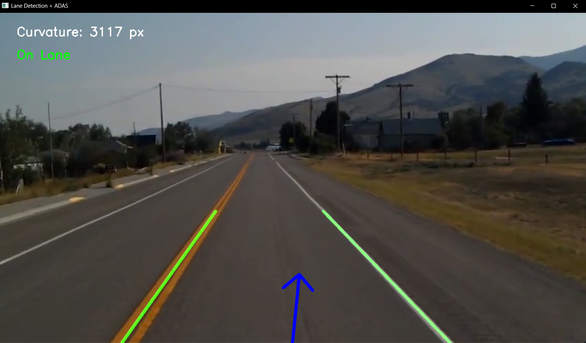

# 🚘 Lane Detection + ADAS (Advanced Driver Assistance System)

This project implements a **lane detection system** with additional ADAS features like steering angle estimation, lane departure warning, and curvature radius measurement.  
It uses **OpenCV + NumPy + Python** to process driving videos and overlay useful driving cues on top of the frames.  

---

## ✨ Features
✅ Lane detection using Canny edge + Hough transform  
✅ Smoothing by averaging left/right lane slopes  
✅ Filled lane area (like Tesla Autopilot visual)  
✅ Steering angle estimation (with blue arrow indicator)  
✅ Curvature radius calculation (for sharp turns)  
✅ Lane departure warning ⚠  
✅ Overlayed video output with all annotations  

---

## 📂 Project Structure
├── lane_detection_full.ipynb # Main script

├── output.mp4 # Output video (Saved Result)

├── requirements.txt # Dependencies

├── test_video.mp4 # Sample driving video (add your own)

└── README.md # Project documentation


---
## 🛠 Requirements
Install dependencies via:
```
pip install -r requirements.txt
```
Main libraries used:

⚪ OpenCV → Image processing, edge detection, line drawing

⚪ NumPy → Math operations, slopes, polynomial fitting

⚪ Math (Python stdlib) → Trigonometry for steering angles

⚪ Jupyter (optional) → Interactive experiments & visualization

⚪ Matplotlib (optional) → Debugging & plots

---

## 🎥 Saving Output

❤️The script saves the processed output as output.mp4.

---
## 🖼 Output Screenshot

<p align="center">
  
</p>

---

## 📊 Example Output

✅Green lines = detected left/right lanes

✅Transparent green polygon = lane area

✅Blue arrow = steering direction

✅Curvature radius + steering angle = displayed text

✅⚠ Lane departure warning if car drifts

---
## 👨‍💻 Author

Abhijith Babu
Passionate about Computer Vision & AI 🚀

📌 GitHub: [https://github.com/AbhijithBabu12]

📌 LinkedIn: [https://www.linkedin.com/in/abhijith-babu-856170201/]

---
## 🚀 Future Improvements

🔮Use Deep Learning (CNNs, SegNet, DeepLab) for robust lane detection

🔮GPS/IMU fusion for real-world ADAS

🔮Integrate with Raspberry Pi for on-car demo
